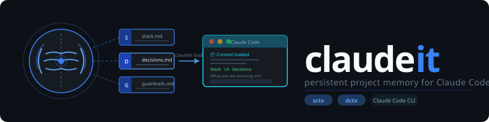

<div align="center">
  
</div>

<br/>

> *Claude forgets. claudeit remembers.*

---

Every session starts the same way. You open Claude Code, say "let's keep working on the auth flow," and Claude says — "Could you remind me of your stack?"

You explain Next.js. Again. You explain Tailwind. Again. You explain why you chose Zustand over Redux three weeks ago. Again.

**claudeit fixes that.** One command at the start of a session and Claude knows everything — your stack, your UI theme, your decisions, your guardrails. You never re-explain. You just work.

## Before / after

**Without claudeit:**
```
You:    "let's add a payment form"
Claude: "Sure! What stack are you using?"
You:    "Next.js, Tailwind, Shadcn, Stripe..."
Claude: "Got it. What's your color theme?"
You:    "Neutral slate, dark mode default, Inter font..."
Claude: "Any conventions I should follow?"
You:    "We already decided not to use modals, everything is—"
```
Five minutes of re-explaining before a line of code.

**With claudeit:**
```
claudeit load

📦 claudeit loaded — Payments Platform
   Stack:        Next.js 14 · TypeScript · Prisma · Tailwind · Stripe
   UI:           Shadcn/ui · slate · dark default · Inter
   Now building: checkout redesign
   Guardrails:   no modals · no third-party analytics

What are we working on today?
```

## How it works

claudeit extends Claude's built-in `CLAUDE.md` system with a `.contextit/` folder of structured project context files. Claude reads them at the start of every session.

```
your-project/
├── CLAUDE.md              ← Claude's built-in memory (unchanged)
└── .contextit/
    ├── stack.md           ← Languages, frameworks, libraries, infra
    ├── architecture.md    ← System design, data flow, patterns
    ├── ui.md              ← Theme, colors, fonts, component library
    ├── features.md        ← Shipped / building / planned / dropped
    ├── decisions.md       ← What was decided and why
    ├── conventions.md     ← Naming, structure, git, testing rules
    └── guardrails.md      ← What NOT to build — Claude enforces this
```

After `claudeit load`, Claude knows all of it. It writes UI code in your theme. It follows your conventions. It never re-suggests approaches you already rejected. It flags new ideas that conflict with your guardrails — before you build them.

## Two modes

### sctx — Solo

Just you. No git required. Context lives in `.contextit/` in your project root. Survives session resets. Claude reads it on load, updates it on save.

```
claudeit init    ← one-time setup, scans your project and asks questions
claudeit load    ← start of every session
claudeit save    ← end of every session
```

### dctx — Distributed

A team sharing one context. Context lives in a shared GitHub repo. Every developer runs `claudeit load` to pull the latest. One developer's decision becomes everyone's context on their next load. New teammates run one command and arrive fully context-aware — no onboarding conversation needed.

```
claudeit init           ← project owner, once
claudeit join <url>     ← every teammate, once
claudeit load           ← everyone, every session
claudeit save           ← everyone, every session
```

## Install

claudeit is a skill for [Claude Code](https://docs.anthropic.com/en/docs/claude-code). Install it with:

```bash
/skills add contextit.skill
```

Then in any Claude Code session, type:

```
claudeit
```

That's it. claudeit takes it from there.

## First time setup

When you type `claudeit` for the first time, Claude asks one question:

```
👋 Welcome to claudeit — project memory for Claude Code.

  [1] SOLO — Just you. No team, no git required.
          Context saved locally on this machine.

  [2] DISTRIBUTED — A team sharing context via a git repo.
          Every developer stays in sync automatically.

Which fits your project? (1 or 2)
```

One answer. Claude branches into the right setup flow and asks questions one at a time — never a form, always a conversation. It scans your codebase first so it only asks about what it couldn't detect.

## Usage

### Every session — solo

```
claudeit load    ← reads .contextit/, briefs Claude on your project
...work...
claudeit save    ← Claude shows what changed, you confirm, files update
```

### Every session — distributed

```
claudeit load    ← git pull latest + reads files + briefs Claude
...work...
claudeit save    ← Claude shows diff, you confirm, git push to team
```

Teammates see your updates on their next `claudeit load`.

### Mid-session updates

Don't wait for save — update context the moment something is decided:

```
claudeit update ui "switched to Geist font"
claudeit update guardrails "no third-party analytics"
claudeit update features "auth — shipped"
claudeit status
```

## Guardrails

The most powerful file in `.contextit/` is `guardrails.md`.

It captures what **NOT** to build — scope limits, banned patterns, technical constraints, ethical lines. Claude checks every new suggestion against it automatically, every session, without being asked.

When something conflicts:

```
⚠️  Guardrail conflict: "Add email notifications"
    Rule: "No email — in-app notifications only. We respect user attention."

    Options:
      [A] Drop it — guardrail stands
      [B] Modify — in-app only, no email
      [C] Override — requires a dated reason logged to guardrails.md
```

Guardrails are permanent. They can be overridden with a reason, never silently deleted.

## Distributed setup

**Step 1 — Project owner runs (once):**
```
claudeit init
```
Claude walks through 4 phases: create repo on GitHub → set up token → build context → push. At the end it gives you one line to share with your team.

**Step 2 — Every teammate runs (once):**
```
claudeit join https://github.com/your-org/project-context.git
```
Claude handles token setup, clones the context, loads everything, and briefs immediately. One command. Fully context-aware from the first session.

## Authentication (distributed only)

claudeit uses HTTPS + Personal Access Token. No SSH setup required.

When you run `claudeit init` or `claudeit join`, Claude detects whether you're already authenticated. If not, it walks you through creating a GitHub token step by step and stores it securely in your OS keychain — never in any file, never committed to git.

| OS | Where token is stored |
|---|---|
| macOS | Keychain |
| Windows | Windows Credential Manager (via Git Credential Manager) |
| Linux | libsecret / GNOME keyring (plaintext fallback with warning) |

Token expired? Run `claudeit login reset` — Claude clears the old one and walks you through a new one.

Full setup guide: [`references/git-token-setup.md`](references/git-token-setup.md)

## Commands

| Command | What it does |
|---|---|
| `claudeit` | Smart entry — loads if initialized, starts setup if not |
| `claudeit init` | First-time setup — asks SOLO or DISTRIBUTED, guides through |
| `claudeit load` | Start of session — pull (dctx) + read context + brief Claude |
| `claudeit save` | End of session — show diff, write files, push (dctx) |
| `claudeit update <file> <change>` | Mid-session context update |
| `claudeit status` | Features snapshot, last save, open TODOs |
| `claudeit join <url>` | Join a distributed project as a teammate |
| `claudeit login` | Set up or refresh git authentication |
| `claudeit login reset` | Clear expired token and re-authenticate |

## What Claude knows after load

| File | What Claude knows |
|---|---|
| `stack.md` | Languages, frameworks, libraries, infra, versions — no more "what are you using?" |
| `architecture.md` | System design, folder structure, data flow, key patterns |
| `ui.md` | Theme, colors, fonts, component library — Claude writes matching UI code automatically |
| `features.md` | What's shipped, building, planned, dropped — no more "where are we?" |
| `decisions.md` | What was decided and why — Claude never re-suggests what you already rejected |
| `conventions.md` | Naming, file structure, git, testing — Claude follows your standards without being told |
| `guardrails.md` | What NOT to build — Claude flags conflicts before you start building |

## Context hygiene

- `decisions.md` and `guardrails.md` are append-only — never edited, only added to
- `features.md` enforces max 3 items in "building" — keeps focus
- Files over 300 lines → Claude archives old entries automatically to keep load fast
- No secrets ever written to `.contextit/` — Claude refuses and warns if detected
- Guardrail overrides require a dated reason — the original rule is never deleted

## FAQ

**Do I need to know git to use this?**  
For SOLO mode — no. No git involved at all. For DISTRIBUTED mode — you need a GitHub account. claudeit handles everything else step by step.

**What if my project directory is empty?**  
Claude runs the setup interview one question at a time and builds context from your answers. Partial context beats no context — you can always add more later.

**Does it work with an existing `CLAUDE.md`?**  
Yes. claudeit appends one pointer line to your existing `CLAUDE.md` and leaves everything else untouched. Both systems work together.

**What if a teammate pushes context I disagree with?**  
claudeit always shows a diff before committing. In distributed mode, treat context changes like code changes — review before merging if your team wants that control.

**Can I use it across multiple projects?**  
Yes. Each project has its own `.contextit/` folder. Completely independent. Run `claudeit init` in each project once.

**What if I want to use GitLab?**  
GitLab support is on the roadmap. The token flow is identical — only the host and scope names differ.

## License

MIT.
